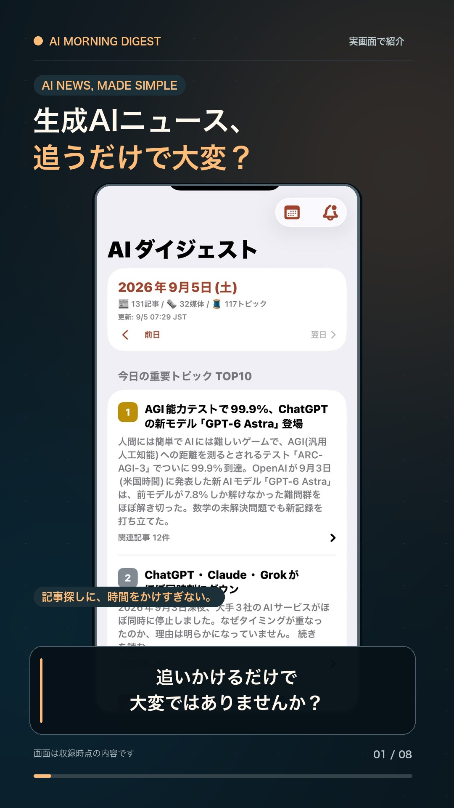

# 🌅 生成AIモーニングダイジェスト

毎朝5:30(JST)に、国内外30以上のメディア・ベンダー公式ブログから**生成AI関連ニュースを抜け漏れなく収集**し、
**大きなトピック順のTOP10 + その他全記事**を1ページにまとめて自動公開するアプリです。

📖 **毎朝ここを見る** → https://takuya-ops.github.io/ai-morning-digest/

## デモ動画

実際のiPhone画面で、ニュースTOP10、通知時刻の設定、過去の日付の閲覧、参照元の記事の確認を55秒で紹介しています。

**[▶ デモ動画を確認したい方はこちら（AIナレーション付き）](https://takuya-ops.github.io/ai-morning-digest/demo/ai-digest-short-narrated.mp4)**

<a href="https://takuya-ops.github.io/ai-morning-digest/demo/ai-digest-short-narrated.mp4"></a>

- [AIナレーション付きで見る](https://takuya-ops.github.io/ai-morning-digest/demo/ai-digest-short-narrated.mp4)
- [ナレーションなしで見る](https://takuya-ops.github.io/ai-morning-digest/demo/ai-digest-short-no-narration.mp4)

どちらも字幕・赤枠・BGM・効果音付きです。動画内のニュースは収録時点の内容です。

## 特徴

- **抜け漏れ防止**: ITmedia AI+ / 日経クロステック / Publickey / GIGAZINE / OpenAI / Google / DeepMind / TechCrunch / The Verge / Hacker News など国内外32媒体のRSSを毎朝取得。TOP10に入らなかった記事も「その他」欄に全件掲載します。
- **大きなトピック順に表示**: 同じ話題を報じる記事を日英またいで自動でまとめ、「何媒体が報じたか×媒体の影響度」でスコアリングしてTOP10を表示します。
- **ニュースの内容まで分かる**: 各トピックに日本語の要約(2〜4文)と「なぜ重要か」を掲載。`ANTHROPIC_API_KEY` を設定するとClaude(claude-opus-5)が要約を生成し、未設定でも記事の説明文から要約を組み立てます。
- **見やすさ重視**: スマホ対応・ダークモード対応の1カラムレイアウト。ランキングバッジ、ソースチップ、折りたたみ式の関連記事一覧。

## 📱 iOSアプリ(ネイティブ)

[ios/](ios/) にSwiftUI製のネイティブiPhoneアプリ「AIダイジェスト」があります。

- 毎朝のダイジェスト(TOP10+全記事)をネイティブUIで表示、引っ張って更新
- **毎朝の通知**: 指定時刻(既定6:30)にローカル通知。アプリ内の🔔から時刻変更可能
- オフラインでも前回取得分を表示
- 記事タップでSafariの元記事へ

**iPhone実機へのインストール**(Apple IDがあれば無料):

1. Macで `ios/AIDigest.xcodeproj` をXcodeで開く
2. プロジェクト設定 → Signing & Capabilities → Team に自分のApple IDを設定
3. iPhoneをUSB接続し、実機を選んで ▶ Run
4. 初回はiPhone側で 設定 → 一般 → VPNとデバイス管理 から開発者を信頼

> 無料のApple IDの場合、署名は7日で期限切れになるため週1回の再インストールが必要です(有料のDeveloper Programなら1年)。

## 📱 スマホ版(PWA)

このサイトはPWA対応です。ホーム画面に追加すると、専用アイコン付きの**アプリとして全画面で起動**し、オフラインでも直近に表示したダイジェストを開けます。

- **iPhone (Safari)**: サイトを開く → 共有ボタン → **「ホーム画面に追加」**
- **Android (Chrome)**: サイトを開く → メニュー(⋮) → **「ホーム画面に追加」(または「アプリをインストール」)**

## 毎朝の通知方法(いずれか)

1. **スマホアプリとして開く**: 上記の手順でホーム画面に追加(毎朝アイコンをタップするだけ)
2. **RSSで通知を受け取る**(おすすめ): RSSリーダー(Feedly、Reeder等)で `https://takuya-ops.github.io/ai-morning-digest/feed.xml` を購読すると、毎朝ダイジェスト1件が通知されます
3. **Slack通知**: リポジトリのSecretsに `SLACK_WEBHOOK_URL`(Incoming Webhook)を設定すると、毎朝TOP10がSlackに届きます

## 仕組み

```
GitHub Actions (毎日 20:30 UTC = 5:30 JST)
  └─ node src/index.js
       1. collect.js   … 32フィードを並列取得、過去26時間分にフィルタ、AI関連判定、重複除去
       2. cluster.js   … エンティティ(企業名・製品名)とタイトル類似度で同一トピックを日英またいで集約
       3. cluster.js   … ソース数×媒体ウェイトでトピックの「大きさ」をスコアリング → TOP10
       4. summarize.js … Claudeで日本語見出し・要約・「なぜ重要か」を生成(APIキーなしでもフォールバック動作)
       5. render.js    … docs/ にHTML・アーカイブ・JSON・RSSを出力
       6. notify.js    … (任意)Slack通知
  └─ docs/ をコミット → GitHub Pagesで公開
```

## セットアップ(フォークして使う場合)

1. このリポジトリをフォーク
2. Settings → Pages → Source を `main` ブランチの `/docs` に設定
3. (任意)Settings → Secrets and variables → Actions に以下を登録
   - `ANTHROPIC_API_KEY` … Claudeによる日本語要約を有効化
   - `SLACK_WEBHOOK_URL` … Slack通知を有効化
4. Actions タブから `daily-digest` を手動実行(workflow_dispatch)して初回生成

## ローカル実行

```bash
npm install
npm run digest          # docs/index.html が生成される
open docs/index.html
```

環境変数:

| 変数 | 既定値 | 説明 |
|---|---|---|
| `DIGEST_TOP_N` | `10` | 上位表示するトピック数 |
| `DIGEST_WINDOW_HOURS` | `26` | 収集対象の時間窓(時間) |
| `ANTHROPIC_API_KEY` | なし | 設定するとClaudeで要約生成 |
| `SUMMARY_MODEL` | `claude-opus-5` | 要約に使うClaudeモデル |
| `SLACK_WEBHOOK_URL` | なし | Slack Incoming Webhook |
| `SITE_URL` / `REPO_URL` | 自動導出 | GitHub Actions上では `GITHUB_REPOSITORY` から自動導出(フォークしてもそのまま動作)。手動指定も可 |

## フィードの追加・削除

[src/feeds.js](src/feeds.js) の配列を編集してください。`weight`(1〜5)がトピックの大きさ算出に、
`aiOnly: false` のフィードには [src/keywords.js](src/keywords.js) のAI関連キーワードフィルタが適用されます。

> **メモ**: Anthropic公式・Meta AI・ledge.ai はRSSフィードを提供していないため直接収集していません(各社の発表はニュースメディア経由でカバーされます)。

## ライセンス

MIT
