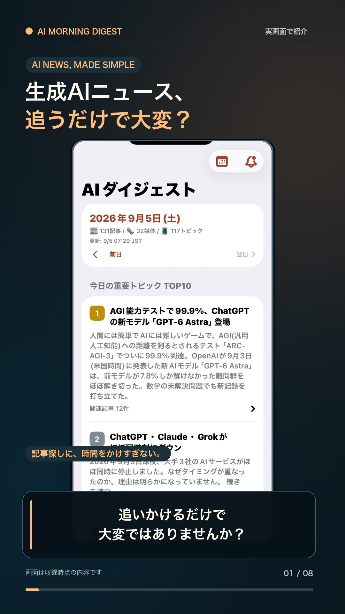

# 🌅 生成AIモーニングダイジェスト

毎朝5:30(JST)に、国内外30以上のメディア・ベンダー公式ブログから**生成AI関連ニュースを抜け漏れなく収集**し、
**大きなトピック順のTOP10 + その他全記事**を1ページにまとめて自動公開するアプリです。

📖 **毎朝ここを見る** → https://takuya-ops.github.io/ai-morning-digest/

## 機能改善の提案と設計書

[2026年10月の機能提案・要件定義書・基本設計書・詳細設計書](specs/2026-10-product-improvements/README.md)を掲載しています。既存コードを確認して整理した設計書です。build 6の実装状況・設計との差分は[実装記録](specs/2026-10-product-improvements/implementation.md)を参照してください。

## 旧版のデモ動画（build 2）

改修前のiPhone画面で、ニュースTOP10、通知時刻の設定、過去の日付の閲覧、参照元の記事の確認を55秒で紹介しています。今回のbuild 4の画面とは異なります。

**[▶ デモ動画を確認したい方はこちら（AIナレーション付き）](https://takuya-ops.github.io/ai-morning-digest/demo/ai-digest-short-narrated.mp4)**

<a href="https://takuya-ops.github.io/ai-morning-digest/demo/ai-digest-short-narrated.mp4"></a>

- [AIナレーション付きで見る](https://takuya-ops.github.io/ai-morning-digest/demo/ai-digest-short-narrated.mp4)
- [ナレーションなしで見る](https://takuya-ops.github.io/ai-morning-digest/demo/ai-digest-short-no-narration.mp4)

どちらも字幕・赤枠・BGM・効果音付きです。動画内のニュースは収録時点の内容です。

## 特徴

- **抜け漏れ防止**: ITmedia AI+ / 日経クロステック / Publickey / GIGAZINE / OpenAI / Google / DeepMind / TechCrunch / The Verge / Hacker News など国内外32媒体のRSSを毎朝取得。TOP10に入らなかった記事も「その他」欄に全件掲載します。
- **大きなトピック順に表示**: 同じ話題を報じる記事を日英またいで自動でまとめ、「何媒体が報じたか×媒体の影響度」でスコアリングしてTOP10を表示します。
- **ニュースの内容まで分かる**: 各トピックに日本語の要約(2〜4文)と「なぜ重要か」を掲載。運営側のClaudeまたはGeminiで生成し、生成できなかった場合は原文の説明文と明示します。
- **見やすさ重視**: スマホ対応・ダークモード対応の1カラムレイアウト。ランキングバッジ、ソースチップ、折りたたみ式の関連記事一覧。

## 📱 iOSアプリ(ネイティブ)

[ios/](ios/) にSwiftUI製のネイティブiPhoneアプリ「AIダイジェスト」があります。

- **今日 / ライブラリ / 設定**の3タブ。記事はアプリ内で読み、出典だけをアプリ内Safariで開きます。
- **音声ブリーフィング**: プルダウンで**Gemini 3.8 / Kore**、Microsoft **Nanami / Keita**、iPhone標準音声を選択。配信音声は日次バッチで事前生成するWAV / MP3をAVAudioPlayerで再生・保存し、標準音声はAVSpeechSynthesizerを使用。再生・一時停止・記事送り・4段階速度・ミニプレイヤー・バックグラウンド音声とロック画面操作の実装を含みます（実機での最終検証は未実施）。
- **通知**: 既定7:00、平日/毎日、タップで再生、2分後のテスト通知。30日先までローカル予約し、起動/バックグラウンド更新で延長。未来の日付に古い見出しを表示しません。
- **オフライン**: SQLiteに当日＋直近7日を取得、30日保持。旧キャッシュを移行し、保存記事は保持期限後も残します。バックグラウンド取得の実行時刻はiOSが決めます。
- **読む・振り返る**: 興味トピック、保存/既読、日付・カレンダーアーカイブ、要約3種・Q&A（新形式の配信分）、画像カード共有、読了記録、Siriショートカット。
- **WidgetKit**: Small / Medium / ロック画面。App Groupで最新の見出しを共有します。

実装範囲・検証結果・残る再提出手順は [store/implementation-status.md](store/implementation-status.md) を参照してください。App Storeの承認・再提出はまだ行っていません。

### build 6の追加機能

- 再生位置を保存して再起動後に再開、15秒送り戻し、15分・30分・記事終了タイマー。起動だけでは自動再生しません。
- 3分・5分・10分・全件のニュース選択。時間指定は日本語・実測時間付きの音声を対象にします。
- 今日の音声をまとめて保存、取得進捗と停止、Wi-Fi自動取得、250 MiBの容量管理。
- 端末内の記事検索（最大5語AND、日付・カテゴリ・保存・未読）、キーワード・カテゴリ・媒体の非表示。
- コレクションと個人メモ、公式資料付き用語集、取得範囲を明示する週次集計。
- Web版に再生・一時停止・次の記事・速度・音声選択。
- Xタブ・投稿案・認証・直接投稿を削除。通常のOS共有シートは利用可能です。

### 日本語要約と配信状態

`ANTHROPIC_API_KEY` があればClaude、なければ `GEMINI_API_KEY` のGeminiで日本語要約・スタイル・Q&Aを生成します。利用者のキーは不要です。失敗時は原文の説明文と明示し、架空の要約やQ&Aを補いません。

v3は旧版の `summary` と `audio` を維持し、`publication`、`editorial`、`narration`、`audioMetadata` を追加します。本文を先にpushし、同じ原稿の音声を生成・検証して追記します。音声だけの再試行は Actions → daily-digest → Run workflow → `retry_audio`。同じ原稿のRelease assetを再利用します。

#### アイコン

build 4で、濃紺を背景に朝日とニュースの行を組み合わせたマークへ更新しました。iOS・PWAの素材を統一しています。[調査した公式資料・デザイン方針・再出力方法](design/README.md)。

### Gemini 3.8 Flash TTS の音声配信

標準のナレーションは `gemini-3.8-flash-tts` / Kore。標準的な日本語で、明瞭・少しゆっくり・文ごとに間を取る指示を `speech_metadata.style` に渡します。指示文を読み上げ本文へ混ぜません。

1. GitHub の Settings → Secrets and variables → Actions に `GEMINI_API_KEY` を登録します。キーをソースやiOSアプリ、配信JSONへ入れません。
2. この変更を `main` に反映して、Actions → daily-digest → Run workflow を実行します。
3. 各記事のWAVを `digest-audio-YYYY-MM-DD` のRelease assetsへ保存し、JSONの `topics[].audio["gemini-3.8-flash-tts-Kore"]` で配信します。モデル・声・話し方・本文が同じなら、その日付の再実行で生成済み音声を再利用します。生成は最大10記事／回です。
4. 更新版iOSアプリで「今日」を更新します。新規インストールはGeminiが標準。既存設定は全記事のGemini音声が届いた時点で一度だけ切り替え、その後に選んだ音声は保持します。自動取得したWAV／既存MP3は7日・250 MiBの範囲でキャッシュし、オフラインでも再生できます。

全記事分が完成したときだけGemini音声を公開します。429/503ではRetry-After（未指定なら60秒）を待って最大3回再試行します。未設定・生成失敗でもニュース配信は続行します。未配信の記事には案内を表示し、端末音声への変更は利用者が選びます。過去記事は自動で再生成しません。

Microsoft Nanami / Keita は引き続き選択できます。手動の単一フェーズ実行での追加生成には `AZURE_SPEECH_KEY` と `AZURE_SPEECH_REGION` が必要です。Geminiは運営側のAPI利用枠を使用し、利用者によるキー入力は不要です。

公式資料: [モデル](https://ai.google.dev/gemini-api/docs/models/gemini-3.8-flash-tts)・[音声生成API](https://ai.google.dev/gemini-api/docs/generate-content/speech-generation)。3.8の通常レスポンスはWAVのため、旧モデル向けのPCMヘッダー追加は行いません。

### ビルドとテスト

```sh
npm ci
npm test
xcodebuild -project ios/AIDigest.xcodeproj -scheme AIDigest \
  -destination 'platform=iOS Simulator,name=iPhone 17 Pro' \
  CODE_SIGNING_ALLOWED=NO test
```

Xcode 26.6で開発、最低iOS 16。外部iOSライブラリは不要です。実機・配布ビルドにはアプリ本体とウィジェット両方の署名、App Group `group.com.takuyaops.aidigest` が必要です。

**iPhone実機へのインストール**(Apple IDがあれば無料):

1. Macで `ios/AIDigest.xcodeproj` をXcodeで開く
2. プロジェクト設定 → Signing & Capabilities → Team に自分のApple IDを設定
3. iPhoneをUSB接続し、実機を選んで ▶ Run
4. 初回はiPhone側で 設定 → 一般 → VPNとデバイス管理 から開発者を信頼

> 無料のApple IDの場合、署名は7日で期限切れになるため週1回の再インストールが必要です(有料のDeveloper Programなら1年)。

## 📱 スマホ版(PWA)

このサイトはPWA対応です。ホーム画面に追加すると、専用アイコン付きの**アプリとして全画面で起動**し、オフラインでも直近に表示したダイジェストを開けます。

- **iPhone (Safari)**: サイトを開く → 共有ボタン → **「ホーム画面に追加」**
- **Android (Chrome)**: サイトを開く → メニュー(⋮) → **「ホーム画面に追加」(または「アプリをインストール」)**

## 毎朝の通知方法(いずれか)

1. **スマホアプリとして開く**: 上記の手順でホーム画面に追加(毎朝アイコンをタップするだけ)
2. **RSSで通知を受け取る**(おすすめ): RSSリーダー(Feedly、Reeder等)で `https://takuya-ops.github.io/ai-morning-digest/feed.xml` を購読すると、毎朝ダイジェスト1件が通知されます
3. **Slack通知**: リポジトリのSecretsに `SLACK_WEBHOOK_URL`(Incoming Webhook)を設定すると、毎朝TOP10がSlackに届きます

## 仕組み

```
GitHub Actions (毎日 20:30 UTC = 5:30 JST)
  └─ node src/index.js
       1. collect.js   … 32フィードを並列取得、過去26時間分にフィルタ、AI関連判定、重複除去
       2. cluster.js   … エンティティ(企業名・製品名)とタイトル類似度で同一トピックを日英またいで集約
       3. cluster.js   … ソース数×媒体ウェイトでトピックの「大きさ」をスコアリング → TOP10
       4. summarize.js … Claudeで日本語見出し・要約・「なぜ重要か」を生成(APIキーなしでもフォールバック動作)
       5. render.js    … docs/ にHTML・アーカイブ・JSON・RSSを出力
       6. notify.js    … (任意)Slack通知
  └─ docs/ をコミット → GitHub Pagesで公開
```

## セットアップ(フォークして使う場合)

1. このリポジトリをフォーク
2. Settings → Pages → Source を `main` ブランチの `/docs` に設定
3. (任意)Settings → Secrets and variables → Actions に以下を登録
   - `ANTHROPIC_API_KEY` … Claudeによる日本語要約を有効化
   - `SLACK_WEBHOOK_URL` … Slack通知を有効化
4. Actions タブから `daily-digest` を手動実行(workflow_dispatch)して初回生成

## ローカル実行

```bash
npm install
npm run digest          # docs/index.html が生成される
open docs/index.html
```

環境変数:

| 変数 | 既定値 | 説明 |
|---|---|---|
| `DIGEST_TOP_N` | `10` | 上位表示するトピック数 |
| `DIGEST_WINDOW_HOURS` | `26` | 収集対象の時間窓(時間) |
| `ANTHROPIC_API_KEY` | なし | 設定するとClaudeで要約生成 |
| `SUMMARY_MODEL` | `claude-opus-5` | 要約に使うClaudeモデル |
| `GEMINI_API_KEY` | なし | Gemini 3.8 Flash TTSの生成キー。GitHub Actions Secretに登録 |
| `AZURE_SPEECH_KEY` | なし | 運営側のMicrosoft音声生成キー。未設定時は生成をスキップ |
| `AZURE_SPEECH_REGION` | なし | Speechリソースのリージョン（例 `japaneast`） |
| `GITHUB_TOKEN` / `GITHUB_REPOSITORY` | Actionsで自動提供 | 日次音声をGitHub Release assetsに保存 |
| `SLACK_WEBHOOK_URL` | なし | Slack Incoming Webhook |
| `SITE_URL` / `REPO_URL` | 自動導出 | GitHub Actions上では `GITHUB_REPOSITORY` から自動導出(フォークしてもそのまま動作)。手動指定も可 |

## フィードの追加・削除

[src/feeds.js](src/feeds.js) の配列を編集してください。`weight`(1〜5)がトピックの大きさ算出に、
`aiOnly: false` のフィードには [src/keywords.js](src/keywords.js) のAI関連キーワードフィルタが適用されます。

> **メモ**: Anthropic公式・Meta AI・ledge.ai はRSSフィードを提供していないため直接収集していません(各社の発表はニュースメディア経由でカバーされます)。

## ライセンス

MIT
