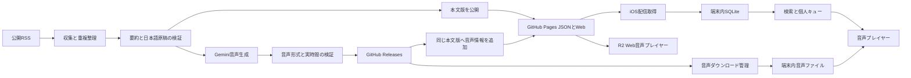
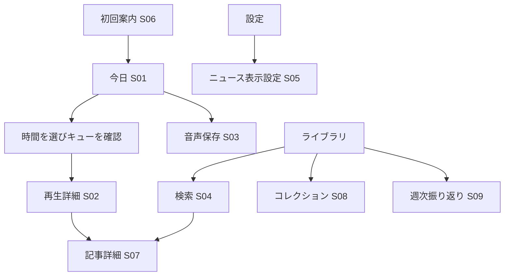

# AIダイジェスト 基本設計書

> 2026-10-04 build 6更新: 本書の初版を基に追加実装した。Xタブ・投稿案・X直接投稿は追加指示により削除。現行仕様・設計変更・検証範囲は[実装記録](implementation.md)を優先する。以下の「提案・未実装」は初版作成時点の記録。

本書は[要件定義書](requirements.md)の13機能を、既存のNode.js・GitHub Pages・SwiftUI・SQLite構成へ組み込む基本設計です。アカウント不要の構成を維持し、個人設定と利用履歴は端末内で処理します。文書版0.1、2026年10月4日作成、提案段階です。以下の新しい構成要素はまだ実装していません。

## 1 設計方針

既存の配信形式に項目を追加し、旧アプリに必要な項目を残します。本文と音声の配信状態を分け、音声の生成待ちで本文の公開を止めない構成へ変更します。個人ごとのキュー、検索、ミュート、メモ、週次振り返りは端末で処理し、ユーザー操作による追加AI呼び出しを避けます。

現行は `DigestStore` と `LocalDatabase` が主にMainActor上で動作しています。検索とダウンロードを追加する際は、永続化を専用actorへ移し、画面状態の更新だけをMainActorに残します。Widgetと既存のX処理へ変更を波及させない境界を設けます。

## 2 全体構成

AI処理に渡すのは公開ニュース由来の文章です。検索語・ミュート・メモ・聴取履歴はこの経路に含めません。既存のX接続は別経路とし、利用者が確認した操作以外で投稿しません。

## 3 コンポーネント構成

| 構成要素 | 既存との関係 | 主な責務 | 対応要件 |
|---|---|---|---|
| `DigestStore` | 改修 | 表示状態、更新、配信版の適用。音声先読みを専用管理へ委譲 | F02・F06 |
| `DigestRepository` | 新規actor | SQLite接続、移行、配信版・検索・進捗・コレクションの保存 | F01・F04・F09・F11 |
| `VoicePreferences` | 新規 | Gemini既定、旧設定の一度だけの移行、手動選択の保持 | F07 |
| `BriefingPlayer` | 改修 | キュー再生、秒数、シーク、タイマー、RemoteCommand、進捗通知 | F01 |
| `BriefingPlanner` | 新規 | 時間上限、興味、未聴、ミュートに応じた再生計画 | F03・F05 |
| `AudioDownloadManager` | 新規actor | `AudioCache`を包み、同時取得数、通信条件、容量、保存セットを管理 | F02 |
| `LibrarySearchService` | 新規 | 文字正規化、検索条件、ページング、結果の取消し | F04 |
| `FilterPreferences` | 新規 | ニュース用ミュートの保存・判定 | F05 |
| `PublicationValidator` | 新規Nodeモジュール | 本文版の識別、状態・JSON・URL・音声時間の検証 | F06・F08 |
| `OnboardingAudioPreview` | 新規 | 同梱サンプルだけを再生。通常記事の状態を変更しない | F07 |
| `CollectionStore` | R2新規 | 保存記事の分類、メモ、削除対象の分離 | F09 |
| `GlossaryStore` | R2新規 | 同梱用語集、出典・更新日、記事内の用語参照 | F10 |
| `WeeklyRecapBuilder` | R2新規 | 取得済みの週次集計と記事導線 | F11 |
| `static/audio-player.js` | R2新規 | Webの音声操作、失敗表示、利用者操作による再生開始 | F12 |

既存ファイルの `MicrosoftAudio.swift` は現在Geminiも含んでいます。実装時に `BriefingVoice.swift` と `AudioCache.swift` へ分割する案ですが、名前変更そのものを先行目的にはしません。Xcodeの参照、テスト、旧キャッシュへの互換を同時に扱います。

## 4 画面と導線

5タブを維持します。新たに多数のタブを増やさず、「今日」に聴く導線、「ライブラリ」に探す導線、「設定」に運用設定を集めます。

| 画面ID | 画面 | 主な追加・変更 | 空・失敗時の表示 |
|---|---|---|---|
| S01 | 今日 | 本文・音声の配信状態、3/5/10分、続きから、音声を保存、キューの確認 | 当日未配信、音声準備中、音声失敗、対象0件を分離 |
| S02 | 再生詳細 | タイムライン、15秒操作、速度、停止タイマー、記事一覧 | 音声変更時の先頭再開、未取得、端末TTSの制限 |
| S03 | 音声ダウンロード | 日付・声・件数・容量、保存・中止・削除 | 回線待ち、容量不足、再試行可能な失敗 |
| S04 | ライブラリ検索 | 検索欄、保存・日付・カテゴリ、結果一覧 | 端末未取得と一致なしを区別 |
| S05 | ニュース表示設定 | 興味トピック、ミュート語・カテゴリ・配信元 | 全件除外時の解除導線 |
| S06 | 初回案内 | 同梱音声の試聴、興味、任意通知 | 通信なしでも試聴。デモに日次配信の未配信表示を使わない |
| S07 | 記事詳細 | 言語・要約状態、R2で用語、コレクション、メモ | 未翻訳、未登録語、要約なしを明示 |
| S08 | コレクション | R2で作成・編集・記事追加 | 空コレクション、メモの保存失敗 |
| S09 | 週次振り返り | R2で期間・取得日数・未聴・保存記事 | 欠けた日付と端末内集計であること |
| S10 | Webの音声欄 | R2で声、再生・停止、記事送り、速度 | 未配信、ブラウザの再生拒否、取得失敗 |

### 4.1 再生中の操作

ミニプレイヤーを押すと再生詳細を開きます。再生中に絞り込みや興味トピックを変えても、現在のキューは固定します。新しい計画を再生しようとしたときに既存の進捗を保存して切り替えます。

配信音声には秒単位操作を提供し、端末TTSでは記事単位の操作を維持します。音声方式を変えたときは、発話速度や区切りが異なるため同じ秒数を機械的に引き継ぎません。音声の欠落を理由に無断で別の声へ変更しません。

### 4.2 状態を伝える文言

| 条件 | 提案文言 |
|---|---|
| 昨日分だけ取得 | 「今日の配信はまだありません。10月3日分を表示しています」 |
| 本文あり、音声処理中 | 「本文は更新済みです。音声を準備中です」 |
| 音声失敗 | 「今日の音声を準備できませんでした。本文は読めます」 |
| 未翻訳記事 | 「この記事は英語の配信元説明文です」 |
| 音声未取得で圏外 | 「音声が端末にありません。接続後にダウンロードしてください」 |
| 旧音源から変更 | 「音声が更新されたため、この記事の先頭から再開します」 |
| 検索結果なし | 「端末内の取得済み記事には見つかりませんでした」 |

内部の429、JSON、APIキー、モデルの実装事情は通常画面で説明せず、運営用の診断情報に残します。設定では声の名称としてGeminiを表示できます。

## 5 配信データの設計

### 5.1 互換と識別

既存の `date`、`generatedAt`、`topics`、`others`、`summary`、`audio` を維持してschema v3を追加します。新版はv2を読めるようにし、未知の項目を無視できる既存デコードを前提に旧アプリで回帰試験します。

現行のiOS `Topic.id` は順位で、`ReaderArticle.id` は代表記事URLです。一方サーバーの `topics[].id` はURL由来のハッシュです。この差を無視して保存済みIDを一括置換しません。既存のURLを `articleKey` として維持し、配信日と組み合わせた `editionKey` を新機能で使用します。音声原稿の変更は別の `scriptHash`、音声実体の変更は `assetSHA256` で判定します。

### 5.2 状態とメタデータ

| データ | 主な内容 | 使用目的 |
|---|---|---|
| publication | 配信版番号、本文のハッシュ、本文・音声の状態、更新日時 | 未配信と生成失敗を区別し、古い再試行を拒否 |
| narration | 言語、原稿ハッシュ、要約の提供方法 | 日本語キュー判定、音声と原稿の照合 |
| audioMetadata | 声、実時間、サイズ、MIME、実体ハッシュ | 時間指定キュー、保存前容量判定、取得検証 |
| editorial | 生成・原文抜粋・未翻訳・検証失敗の区分 | 誤解しない記事表示 |

既存の `audio[voice]` のURLは、これまでどおり全対象記事分が完成した声だけに載せます。部分的な生成物はRelease上にあっても公開JSONの再生可能なURLにはしません。失敗から再実行するときは同じ本文版を使い、完成済みの資産を再利用します。

## 6 配信処理と運用

1. RSS収集・整理を行い、要約結果とフォールバックを検証する。本文が空なら前回公開物を残して失敗を報告する。
2. 本文版の `contentRevision` を確定し、音声状態をpendingとして本文JSON・HTMLをステージング領域に生成する。既存の同じ本文版で音声がreadyなら、pendingへ戻さず再利用する。
3. データを検証してGitへコミットし、Pagesで本文が取得できることを確認する。
4. その本文版を固定入力としてGemini音声を生成する。現行の再試行と同一音声の再利用を維持する。音声の形式、実時間、ハッシュを検証する。
5. 全対象が完成したら音声状態をreadyとし、同じ本文版にURLとメタデータを追加する。失敗時は本文を保持し、音声状態だけfailedにする。
6. 公開後にJSON・全音声URLを検証し、本文成功と音声成功を別にレポートする。運営向けのActions要約を残す。外部への自動通知先追加はこの設計に含めない。

ワークフロー全体の並行実行グループを維持し、手動再生成も同じ制御へ入れます。別の本文版が公開されていたら最新JSONを上書きせず、対象日版が一致する場合だけ過去版の補修を許可します。

ローカル通知は「読む時間のリマインダー」です。配信完了と連動したPush通知はR1/R2では実装しません。通知から起動した際に最新情報を取得し、未到着ならその状態を表示します。背景実行の時刻はOSが決めるため、Wi-Fi自動取得にも定刻保証を付けません。[Appleの説明](https://developer.apple.com/documentation/backgroundtasks/choosing-background-strategies-for-your-app)

## 7 端末内データとライフサイクル

| データ | 保持方針案 | 削除・変更時 |
|---|---|---|
| 配信本文 | 現行30日。保存・メモに紐づく版は期限後も保持 | キャッシュ削除で保存本文を消さない |
| 再生位置・聴了区間 | 対象本文と同期間 | 音声ハッシュ変更で秒数と区間を無効化 |
| 自動取得音声 | 最大7日かつ容量上限内 | 古い最終利用順で削除。再生中は保護 |
| 手動保存セットの音声 | 明示解除まで | 上限不足なら取得を止めて整理を案内 |
| ミュート・音声・興味設定 | 利用者が変更するまで | リセットは対象を明示 |
| メモ・コレクション | 利用者が削除するまで | クラウド同期・バックアップ提供は対象外 |
| 週次集計・検索結果 | 元データから再生成 | 永続的なAI要約として保存しない |

音声キャッシュは既存のURLハッシュによるファイル名を引き継ぎます。新しい管理テーブルへ遅延登録し、旧キャッシュを一括消去しません。保存済み記事の「保存」と音声セットの「ダウンロード」は別の概念です。

## 8 通信と境界

配信JSONは既存のPages配下からHTTPSで取得します。音声URLは同じリポジトリのGitHub Release URLを入口として検証し、GitHubが返すCDNリダイレクトを許容します。音声取得にAPIキーやGitHub認証トークンを付けません。サイズ上限、HTTPS、実体ハッシュ、音声デコードを確認し、失敗した一時ファイルは本キャッシュへ昇格しません。

検索、計画作成、メモ、ミュート、週次集計はネットワークなしで実行可能にします。画像と出典は従来どおり外部サイトへ接続するため、本文キャッシュだけで原文サイト全体がオフラインになるとは表示しません。

## 9 R2の拡張設計

F09では、コレクションとメモを配信版に紐づけ、複数コレクションへの参加を許可します。削除をcascadeさせるのはコレクションの所属情報だけです。

F10では、編集済みの用語集JSONを同梱し、説明・出典・確認日を表示します。記事本文を自動で書き換えず、登録用語の一覧または注釈ボタンを別に表示します。

F11では、7日間の取得済み配信版からテーマ別件数、未聴、保存記事を構成します。記事を読んだことと音声を聴いたことは別に集計します。同じURLの複数日掲載はまとめ表示できますが、元の配信日へ戻れるようにします。

F12では、HTMLの標準audio要素にRelease URLを渡します。GitHubの配信URLで実ブラウザ再生を確認することを実装着手時の技術ゲートとします。成功前にCORSを回避するための無認証プロキシは作りません。Webのオフライン音声保存を約束せず、既存Service Workerの同一オリジン制限を維持します。

## 10 実装順序と検証

| 段階 | 変更範囲 | 完了の判断 |
|---|---|---|
| A | 配信JSON契約・検証用fixture・状態モデル | v2/v3・旧アプリの互換テストが通る |
| B | F06・F07・F08と実時間メタデータ | 本文単独公開、音声追記、サンプル、日本語状態を確認 |
| C | DB移行・F01・F02 | 旧保存を維持し、再生再開と機内モード再生が通る |
| D | F03・F04・F05・F13 | 時間上限・検索・ミュート・読み上げ支援の受入試験が通る |
| E | TestFlightでR1評価 | 要件定義の利用者課題を評価し、重大な欠陥を解消 |
| F | F09〜F12 | R2の採否と技術ゲートを再確認後に実装 |

iOS変更は配信サーバーの追加項目を先に公開し、その後TestFlightで検証します。ロールバックは日付版・本文版を指定して最後に確認できたJSONへ戻す方式です。アプリのDBは追加移行を原則とし、配布済み旧アプリへ戻す場合も既存4テーブルを破壊しません。

## 11 運用上の判断が必要な事項

250MiBの上限、7日の自動削除、日本語要約のプロバイダと利用枠、評価端末、R2の採否は提案初期値です。実装前にプロダクト所有者が確定します。利用者キー不要という方針は維持しますが、運営側のAPI費用がゼロであるとは仮定しません。
