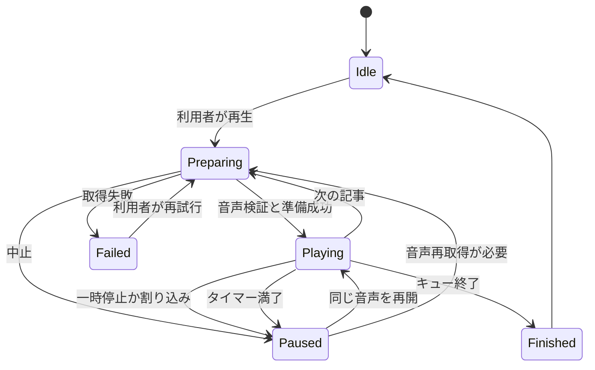
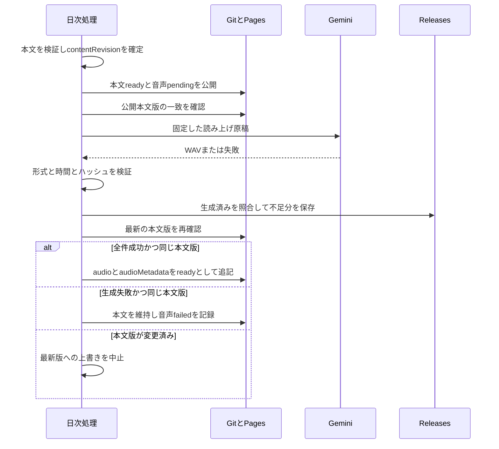

# AIダイジェスト 詳細設計書

本書は[基本設計書](basic-design.md)を実装へ落とし込むため、データ契約、永続化、状態遷移、処理手順、例外、試験を定義します。文書版0.1、2026年10月4日作成、提案段階です。コードやSQLは設計例であり、この文書の作成によってアプリ・DB・ワークフローを変更したものではありません。

## 1 変更箇所

| 既存ファイル | 変更内容案 | 対応 |
|---|---|---|
| `src/index.js` | 本文公開と音声追記を分離。同じ入力版を再使用する実行モード | F06 |
| `src/summarize.js` / `src/enrich.js` | 要約状態・原稿言語・検証結果を追加。未設定時の正直なフォールバックを維持 | F08 |
| `src/speech.js` | 成功URLだけでなく声別結果・生成件数・実時間・ハッシュを返す | F03・F06 |
| `src/render.js` | v3追加項目、配信状態の表示。R2でWebプレイヤー | F06・F12 |
| `.github/workflows/daily.yml` | 固定入力・本文公開・音声更新・公開検証・別々の成功判定 | F06 |
| `ios/AIDigest/Models.swift` | optionalなv3項目、配信版キー、音声メタデータ | F03・F06・F08 |
| `ios/AIDigest/LocalDatabase.swift` | 既存テーブルを残す移行。DBアクセスをRepository actorへ寄せる | F01・F04・F09・F11 |
| `ios/AIDigest/DigestStore.swift` | Repositoryへのawait、版適用、ダウンロード管理の呼び出し | F02・F06 |
| `ios/AIDigest/BriefingPlayer.swift` | 再生時間、シーク、進捗、タイマー、聴了区間 | F01 |
| `ios/AIDigest/MicrosoftAudio.swift` | VoicePreferencesと容量管理への接続。旧MP3・WAVを継続対応 | F02・F07 |
| `ContentView.swift` / `LibraryView.swift` | 計画・再生詳細・検索導線 | F01・F03・F04・F05 |
| `SettingsView.swift` / `ArticleDetailView.swift` | 試聴、保存容量、ミュート、言語表示、R2のメモ・用語 | F02・F05・F07・F08・F09・F10 |
| `NotificationManager.swift` / `AIDigestApp.swift` | 当日号確認後の再生判断、背景期限時の保存・中止 | F01・F06 |

この表以外のX認証・投稿ロジックは機能変更しない。DBの呼び出し境界を変える場合には既存X下書きの回帰試験を行う。

## 2 識別子と配信契約

### 2.1 識別子

| 名前 | 定義 | 変更時の扱い |
|---|---|---|
| `articleKey` | 既存ReaderArticle.idと同じ代表記事URL文字列。othersでは自身のlink | 順位が変わっても同じ記事。配信側で新たな正規化を導入しない |
| `editionKey` | SHA-256の64桁小文字hex。UTF-8の `date + "\n" + articleKey` | 同じURLでも配信日が異なれば別版 |
| `contentRevision` | 配信本文の正規化JSONから求めるSHA-256 | 本文が変わったら古い音声追記を拒否 |
| `scriptHash` | 実際にTTSへ渡す文字列のUTF-8 SHA-256 | 原稿が変わったら再生位置と旧音声を引き継がない |
| `assetSHA256` | ダウンロード対象音声の全バイトのSHA-256 | 声・話し方・再生成で実体が変われば別音声 |
| `cacheKey` | HTTPS URL文字列のSHA-256 | 現行AudioCacheの命名と互換を保つ |

`contentRevision`の入力は、date、順位順topicsのarticleKey・見出し・本文・各要約・原稿・言語・FAQ・出典、およびothersの表示内容。キーを辞書順に整列し、配列順序を保持する。generatedAt、音声URL、取得時刻、publicationの更新時刻は含めない。同じ日・同じ本文は再実行で同じ値となることをfixtureで保証する。

サーバー既存の `topics[].id` は社会投稿案などで使われるハッシュのまま維持する。これを既存iOSのURL主キーへ無断で置換しない。

### 2.2 v3 JSONの例

以下は架空の1記事を使った契約例であり、実際の10月4日ニュースやアクセス可能な音源を表さない。既存必須項目も記載している。

```json
{
  "schemaVersion": 3,
  "date": "2026-10-04",
  "generatedAt": "2026-10-03T21:00:00Z",
  "since": "2026-10-02T19:00:00Z",
  "stats": {"articleCount": 1, "feedCount": 1, "topicCount": 1},
  "publication": {
    "revision": 2,
    "contentRevision": "cccccccccccccccccccccccccccccccccccccccccccccccccccccccccccccccc",
    "textState": "ready",
    "updatedAt": "2026-10-03T21:03:00Z",
    "audioByVoice": {
      "gemini-3.8-flash-tts-Kore": {"state": "ready", "expectedCount": 1, "generatedCount": 1}
    }
  },
  "topics": [{
    "id": "existing-server-id",
    "rank": 1,
    "articleKey": "https://example.com/news",
    "headline": "テスト用ニュース",
    "summary": "架空の契約サンプルです。",
    "sourceCount": 1,
    "articles": [{"title": "テスト用ニュース", "link": "https://example.com/news", "feedName": "Example", "lang": "ja", "date": "2026-10-03T20:00:00Z"}],
    "ttsText": "テスト用ニュース。架空の契約サンプルです。",
    "aiGenerated": true,
    "editorial": {"method": "ai_summary", "language": "ja", "status": "ready"},
    "narration": {"language": "ja", "scriptHash": "aaaaaaaaaaaaaaaaaaaaaaaaaaaaaaaaaaaaaaaaaaaaaaaaaaaaaaaaaaaaaaaa"},
    "audio": {"gemini-3.8-flash-tts-Kore": "https://github.com/Takuya-ops/ai-morning-digest/releases/download/digest-audio-2026-10-04/example.wav"},
    "audioMetadata": {
      "gemini-3.8-flash-tts-Kore": {
        "durationSeconds": 20.0,
        "byteLength": 960044,
        "mimeType": "audio/wav",
        "assetSHA256": "bbbbbbbbbbbbbbbbbbbbbbbbbbbbbbbbbbbbbbbbbbbbbbbbbbbbbbbbbbbbbbbb",
        "scriptHash": "aaaaaaaaaaaaaaaaaaaaaaaaaaaaaaaaaaaaaaaaaaaaaaaaaaaaaaaaaaaaaaaa"
      }
    }
  }],
  "others": []
}
```

### 2.3 検証規則と互換

- `publication.revision`: 配信日ごとの正整数。同じ本文への音声追記でも増加。`contentRevision`とは役割を分ける。
- `textState`: 公開するJSONではready。本文生成が失敗した場合は既存JSONを保持し、失敗は運営レポートへ記録する。
- `audioByVoice.state`: pending、ready、failed、unavailable。キー未設定や旧日付で未提供ならunavailable。終了した処理のエラーをpendingとして残さない。
- readyでは `expectedCount == generatedCount == topics.length`。全topicに対応声のaudioとaudioMetadataが存在すること。部分成功URLはJSONへ載せない。
- 本文版の変化後には旧音声URLを新しい本文へ移さない。同じ本文版のreadyを再実行でpendingやfailedへ後退させない。
- 音声長は有限の正数、1ファイル32,000,000bytes以下。WAV形式・RIFF長・fmt/dataチャンクと音声デコードを確認し実時間を求める。拡張子だけで形式を断定しない。
- `editorial.method`: ai_summary、source_excerpt。`status`: ready、untranslated、unavailable。`language`: ja、en、und。言語が不明ならundとして日本語キューから外す。
- URLはHTTPS。同じリポジトリのRelease download URLを入口として確認。音声取得後はbyteLengthとassetSHA256を一致確認。
- v2の新項目欠落はエラーにしない。audio辞書が揃うかで旧音声利用を判断し、実時間が不明なら時間指定の対象から外す。日付・本文・保存は従来どおり利用できる。
- 未知の状態値は未対応として扱い、クラッシュや「成功」への読み替えをしない。
- 新しいoptional項目は項目単位で検証するカスタムデコードを実装する。不正な音声メタデータだけで有効な本文を捨てず、その声を未対応として扱う。既存必須項目が不正なら配信版全体を適用せず前回キャッシュを使う。
- 日時はUTCのISO 8601、配信日と週境界はJST。日付は正規表現に加え実在日付と往復一致を検証する。

## 3 SQLiteと移行

### 3.1 テーブル案

既存のdigests、articles、completed、draftsは維持する。以下は追加テーブルの概念DDLで、R1は最初の7テーブル、R2はcollections以降を追加する。既存DBでは未使用の `PRAGMA user_version` をDBスキーマ版として使い、JSONのschemaVersionとは混同しない。

```sql
CREATE TABLE article_editions (
  edition_key TEXT PRIMARY KEY,
  article_id TEXT NOT NULL,
  digest_date TEXT NOT NULL,
  content_revision TEXT NOT NULL,
  payload TEXT NOT NULL,
  search_text TEXT NOT NULL,
  mute_text TEXT NOT NULL,
  source_key TEXT NOT NULL,
  UNIQUE(digest_date, article_id)
);
CREATE INDEX idx_editions_date ON article_editions(digest_date DESC);
CREATE TABLE edition_categories (
  edition_key TEXT NOT NULL REFERENCES article_editions(edition_key) ON DELETE CASCADE,
  category TEXT NOT NULL,
  PRIMARY KEY(edition_key, category)
);
CREATE INDEX idx_edition_categories ON edition_categories(category, edition_key);
CREATE TABLE playback_checkpoint (
  slot INTEGER PRIMARY KEY CHECK(slot = 1),
  queue_json TEXT NOT NULL,
  edition_key TEXT NOT NULL,
  voice TEXT NOT NULL,
  asset_sha256 TEXT,
  position_seconds REAL NOT NULL CHECK(position_seconds >= 0),
  rate REAL NOT NULL,
  updated_at REAL NOT NULL
);
CREATE TABLE listening_progress (
  edition_key TEXT NOT NULL,
  voice TEXT NOT NULL,
  asset_sha256 TEXT NOT NULL,
  intervals_json TEXT NOT NULL,
  completed_at REAL,
  PRIMARY KEY(edition_key, voice, asset_sha256)
);
CREATE TABLE audio_assets (
  cache_key TEXT PRIMARY KEY,
  url TEXT NOT NULL,
  relative_path TEXT NOT NULL,
  asset_sha256 TEXT,
  byte_length INTEGER NOT NULL CHECK(byte_length >= 0),
  duration_seconds REAL,
  state TEXT NOT NULL,
  last_accessed_at REAL NOT NULL
);
CREATE TABLE offline_packs (
  id TEXT PRIMARY KEY,
  digest_date TEXT NOT NULL,
  voice TEXT NOT NULL,
  created_at REAL NOT NULL
);
CREATE TABLE offline_pack_assets (
  pack_id TEXT NOT NULL REFERENCES offline_packs(id) ON DELETE CASCADE,
  cache_key TEXT NOT NULL REFERENCES audio_assets(cache_key),
  PRIMARY KEY(pack_id, cache_key)
);
CREATE TABLE collections (
  id TEXT PRIMARY KEY,
  name TEXT NOT NULL,
  created_at REAL NOT NULL
);
CREATE TABLE collection_items (
  collection_id TEXT NOT NULL REFERENCES collections(id) ON DELETE CASCADE,
  edition_key TEXT NOT NULL REFERENCES article_editions(edition_key),
  PRIMARY KEY(collection_id, edition_key)
);
CREATE TABLE article_notes (
  edition_key TEXT PRIMARY KEY REFERENCES article_editions(edition_key),
  text TEXT NOT NULL,
  quoted_text TEXT,
  updated_at REAL NOT NULL
);
```

ミュートと小さな設定はUserDefaultsのバージョン付きCodable値へ保存する。キューは最大100件、検索語100文字、ミュート語1件100文字・合計100件、コレクション名40文字、メモ10,000文字を初期上限案とする。上限は画面に表示し、無言で切り捨てない。

### 3.2 移行手順

1. 新Repositoryを起動する前に、旧DBへの書き込みを止める。SQLite backup APIでWAL内容を含む復元用コピーを作る。WAL利用中のsqliteファイルだけをコピーしない。
2. 専用actorでDBを開き、foreign_keysを有効にしてから `BEGIN IMMEDIATE`。user_version=0から1へR1テーブルを追加する。
3. digestsのJSONと、保持期限外でもarticlesに残る保存記事をデコードし、URLと配信日からeditionKeyを作る。旧read_at・saved_at・draftsは書き換えない。
4. 原文のpayload、正規化検索文、ミュート用本文、代表配信元をarticle_editionsへ登録し、カテゴリをedition_categoriesへ登録。v2のcontentRevisionはローカル正規化本文から計算し、v3取得時にサーバー値へ更新する。
5. 件数と主キーの一致を確認してuser_version=1としCOMMIT。失敗したらROLLBACKして旧データを保持し、読み取り専用の復旧案内を表示する。空DBに作り直さない。
6. R2では1から2へコレクション等を追加する。旧アプリは既存テーブルだけを利用できるが、旧アプリで新機能を操作できることまでは保証しない。

article_editionsの通常削除条件は30日経過、未保存、メモなし、コレクション所属なし、現在の復元対象キューに含まれないこと。孤立した検索文・聴了情報は同じトランザクションで削除する。メモを消す操作と本文キャッシュを消す操作は分離する。

## 4 音声再生の実装

### 4.1 インターフェース案

```swift
struct QueueItem: Codable, Identifiable {
    let id: String                    // editionKey
    let articleID: String             // legacy URL
    let digestDate: String
    let scriptHash: String?
    let assetSHA256: String?
    let audioURL: URL?
    let durationSeconds: Double?
}

@MainActor protocol BriefingPlayback {
    func start(_ items: [QueueItem], resume: Bool) async
    func seek(to seconds: Double)
    func skip(seconds: Double)         // ±15
    func pause()
    func stop(saveProgress: Bool)
    func setSleepTimer(_ timer: SleepTimerMode)
}

enum SleepTimerMode { case off, minutes(Int), endOfArticle }
```

再生状態はidle、preparing、playing、paused、failed、finishedをenumで保持する。現在のplaying/preparingの2個のBoolから不可能な組み合わせを作らない。UIは状態から導出する。



### 4.2 保存と再開

- 音声位置を再生中5秒ごと、および一時停止・音声変更・バックグラウンド移行・記事送り時に保存する。保存失敗時も再生は続け、復元できない旨を控えめに表示する。
- UIの時間表示は0.5秒間隔で更新してよいが、DBへの書き込みは5秒間隔とし、VoiceOverへの秒数通知を抑制する。
- 再開時はeditionKey、voice、scriptHash、assetSHA256が一致することを確認する。旧メタデータ欠落時はURL一致とローカル検証を使い、不確実なら記事先頭から再開する。
- 保存キューは順番と版を保持する。新着記事やミュート変更で復元対象を差し替えない。削除された項目は件数を表示し、利用者が残りで再開できるようにする。
- 位置は `[0, duration]` にclampする。終了済みキューは「もう一度聴く」を表示する。
- 端末TTSでは秒数保存・任意シークを提供しない。記事IDとキューのみ復元し「この記事の最初から」と表示する。

### 4.3 聴了の定義

自然再生で経過した音源時間の区間を蓄積し、重複区間をマージする。シークのジャンプ区間や一時停止中は加算しない。速度変更後も音源時間の区間で扱う。区間の累計が音源の90%以上で、正常な終了コールバックを受けたときに聴了とする。再生終了だけで聴了にする既存の処理とは分離する。

記事を開いたことによる既読は現行どおり維持する。キュー完了・聴了・既読・当日読了日はそれぞれ別の記録とする。時間指定の短いキューを完了しただけで「全10記事を聴了」と表示しない。

### 4.4 タイマーとロック画面

15分・30分は停止期限をメモリに保持し、再生中の単調時計で判定する。背景音声の実行中にも期限を確認し、一時停止中に期限が来た場合は次のresumeで再生させずタイマー終了とする。再起動でタイマーは解除し、音声を勝手に再生しない。「この記事の最後」は次の記事へ進む前に止める。

RemoteCommandCenterには既存の再生・停止・記事送りに加えて、skipForward/BackwardとchangePlaybackPositionを登録する。端末TTSのシークは無効化する。コマンドの購読ハンドルは保持し破棄時に解除する。[Apple公式のコマンド一覧](https://developer.apple.com/documentation/MediaPlayer/MPRemoteCommandCenter)

## 5 音声保存の実装

### 5.1 取得の手順

1. VoicePreferencesから声を1回解決し、キュー作成時に固定する。旧コードのNanami固定フォールバックを廃止する。
2. マニフェストを読み、既存キャッシュ・取得中タスクを照合する。同じcacheKeyは1タスクにまとめ、全体の同時取得数は2とする。
3. NWPathMonitor等で回線状態を把握する。自動取得はWi-Fi相当かつ非高コスト・非制限回線でのみ開始する。バックグラウンド実行はベストエフォートとする。
4. 空き容量と上限を確認する。検証済みサイズ合計に加え、一時ファイルと再生中ファイルを含めて判断する。必要容量+20MiBの空き余裕を初期案とする。
5. 一時ファイルへ書き込み、HTTP成功、サイズ、ハッシュ、WAV/MP3形式、AVAudioPlayerでのデコード・時間を検証する。期限切れURL等は利用者向けの取得失敗へ変換する。
6. 原子的に本ファイルへ移動し、DBをreadyへ更新する。途中終了した一時ファイルは次回起動時に回収する。
7. オフラインセットの全資産がreadyのときだけ「ダウンロード済み」と表示する。

取得状態はqueued、waitingForNetwork、downloading、ready、failed。取消しはタスクを止めて未完の一時ファイルだけを削除し、完成済みファイルは維持する。フォアグラウンドの短い取得を基本とし、長時間のbackground URLSessionへの移行は別の技術検証後とする。中断からのHTTP Range再開は必須にせず、未完の1ファイルを再取得する。

### 5.2 容量と競合

既定上限は250×1024×1024bytes。手動保存セットと再生中ファイルは保護する。非固定ファイルの最終使用日時が古い順に解放しても足りなければ、新しい取得を開始せず必要容量を表示する。複数の取得が同時に空き容量を見積もって超過しないよう、actor内で予定容量を予約する。

再生中ファイルの削除要求はそのファイルを除外するか、停止後削除を選べるようにする。オフラインセットの解除は「固定を外す」操作で、他セットや再生中キューが参照する音声を削除しない。DBとファイルの片方しか存在しない場合は起動時に整合を取り直す。

## 6 マイブリーフィングのアルゴリズム

入力は、取得済み当日TOP記事、声、速度、時間上限、興味トピック、ミュート、聴了情報。再生可能で日本語と確認できた記事だけを時間指定候補にする。言語不明・未翻訳・未配信・実時間不明の除外件数をプレビューに表示する。「すべて」では言語の違いと時間不明を示した上で手動選択できる。

```text
candidates = currentEdition.topics
  where not muted
  and audioForVoiceIsReady
  and narration.language == "ja"
  and verifiedDuration > 0
order by (isListened ? 1 : 0, followedTopicPriority, originalRank)

budget = selectedMinutes * 60
remaining = budget
selected = []
for article in candidates:
    needed = duration(article) / selectedRate
             + (selected is empty ? 0 : 0.4)
    if needed <= remaining:
        selected.append(article)
        remaining -= needed
return selected, excludedReasons, budget - remaining
```

これは順序を重視したgreedy選択であり、時間を隙間なく埋める最適化ではない。ユーザー価値は重要記事を無理なく聴けることなので、厳密な組合せ最適化は行わない。速度・声・条件を変えたら計画を再計算するが、再生開始後は変更しない。0件なら時間を広げるか「すべて」を選ぶ導線を表示する。

## 7 検索とミュート

### 7.1 検索

日本語を含む小規模ローカル検索には、まず正規化文字列の部分一致を使う。日本語の単語分割が不確かなFTS設定を前提にしない。検索用文字列は見出し、要約3種、出典名、カテゴリをNFKC正規化して英字を小文字へ変換する。クエリも同様に変換し、空白で最大5語に分割してAND条件にする。

```sql
SELECT edition_key, article_id, digest_date, payload
FROM article_editions
WHERE instr(search_text, ?) > 0
  AND instr(search_text, ?) > 0
  AND digest_date >= ? AND digest_date <= ?
ORDER BY digest_date DESC, edition_key ASC
LIMIT 50 OFFSET ?;
```

実際には語数分の条件だけを生成し、値は全てバインドする。カテゴリ・保存・既読・ミュートの条件はLIMITより前に適用する。カテゴリはedition_categoriesへのEXISTS、保存・既読は既存articlesとのarticle_idによるJOIN、配信元はsource_keyの完全一致で判定する。ミュート語は見出し・要約だけの正規化列mute_textに対する `instr(mute_text, ?) = 0`、カテゴリはNOT EXISTS、配信元はバインドしたNOT INで除外する。UserDefaultsから解決した条件をパラメーターへ変換し、検索専用の設定複製をDBに作らない。

入力は200ms debounceし、新しい検索が来たら古い要求を取消しまたはrequestIDで結果適用を拒否する。空クエリはフィルター付きの最近の一覧、語数超過は入力案内、日付逆転はエラーを示す。メモ本文は初期検索に含めず、F09で別の検索対象として明示的に追加できる。

### 7.2 ミュート

語句は検索と同じ正規化を行い、見出し・要約に部分一致させる。配信元はフィード設定由来のsourceKey（初期版はfeedName）に完全一致、カテゴリはラベルに完全一致。複数出典記事は代表出典だけでニュース全体のミュートを決め、関連出典に含まれるだけでは記事全体を消さない。フィード名変更は設定の移行対象として扱う。

保存済みデータは削除しない。検索は「除外も含む」の明示操作でミュートを一時的に無視できる。Xアカウント非表示の設定はこの処理へ混ぜない。

## 8 配信処理の詳細

### 8.1 本文と音声の二段階公開



生成用の固定入力をActions artifactへ保存し、再試行でニュースを収集し直さない。JSON更新前にはリモートブランチを再取得し、contentRevisionと期待するpublication.revisionを比較する。同時更新があれば最新を読み直して条件を再判定する。無条件の古いファイル再pushをしない。

音声の検証にはffprobe等を使い、依存するバージョンをCIで固定する。RIFFには追加チャンクがあり得るため、44bytes固定として実時間を計算しない。24kHz mono PCM16という実測だけを将来も固定のAPI契約と見なさない。

### 8.2 再試行と実行予算

429/503のみを自動再試行対象とし、認証エラー400/401/403ではキー・設定の運営対応へ進む。1記事は初回+最大3回、Retry-Afterがあれば従い、なければ60秒。待機上限120秒を超える指定では早く再送せず、その実行を延期扱いにする。日次の音声処理に20分の提案上限を設ける。

記事最大10件、声は既定1種。追加声は明示設定のみ。再実行で存在する音声を使い、欠落分だけを生成する。日次リクエスト数は初回生成最大10、再試行を含む上限40/声とするが、成功時の課金だけとは仮定しない。予算は次の式で管理し、単価・無料枠をコードに固定しない。

```text
推定API費用 = Σ(実行時に取得した入力使用量 × 入力単価
               + 出力使用量 × 出力単価)
日次予算超過の見込み -> 残りの生成を中止し本文を維持
```

利用量がレスポンスで取得できない場合は「費用不明」とし、0円とは記録しない。月次予算と要約用API予算は別に設定する。金額の初期値は所有者の決定待ち。

### 8.3 運用レポート

Actionsの要約にdate、contentRevision、本文公開成否、声別生成件数、再試行数、公開検証結果、経過時間、取得できた使用量を出す。APIレスポンス全文・キー・個人情報は記録しない。音声失敗時は本文公開ジョブが成功していても音声ジョブを失敗またはdegradedと判定し、最終検証ジョブは未完成を検知できるようにする。

定期処理そのものが動かなかった場合はアプリの配信日表示で検知できるが、運営への確実な能動通知は別の監視基盤が必要である。今回の範囲ではActionsの履歴確認と手動再実行の手順を整える。

### 8.4 通知からの起動

通知のautoplay要求は保留中の操作として保持し、DigestStore.refreshの完了または失敗を待つ。当日JSTの配信日、再生対象あり、選択声の音声利用可能をすべて満たす場合だけ、利用者が事前に有効化した通知連動再生を開始する。未配信・取得失敗・音声未提供なら自動再生要求を消費して状態を表示し、保存済みの過去号を黙って再生しない。後日の更新で古いautoplay要求を再発火させない。

通知自体の文言は「AIニュースを確認する時間です」とし、未確認の配信完了を断定しない。通常のアプリアイコン起動やバックグラウンド更新で自動再生は開始しない。

## 9 初回体験と日本語要約

### 9.1 サンプル

固定の短文を運営側でGemini生成し、音声と台本をアプリBundleへ同梱する。通常のBriefingPlayerへ架空のReaderArticleを渡す方法をやめ、独立したAVAudioPlayerを用いる。サンプルの完了は既読・聴了・当日読了に記録しない。画面離脱時に停止する。キーは含めない。

### 9.2 音声設定

`VoicePreferences.selectedVoice`だけがUserDefaultsのbriefingVoiceと移行フラグを読む。初回Gemini、旧設定の一度だけの移行、移行後の手動選択保持という現行方針を維持する。オンボーディング試聴は選択声を変更せず、先読みも同じVoicePreferencesから読む。

### 9.3 要約と言語

既存Anthropic経路を有効化する案を第一候補とするが、APIキー・モデル・予算の設定を所有者が決定してから接続する。生成結果にはschema検証、出典との紐づき、空欄、重複スタイル、数値・固有名詞の確認を行う。自動チェックで事実の正しさを完全に保証できないため、初回公開とプロンプト変更時には日本語/英語由来の記事を含む手動評価セットを確認する。

単純な日本語文字の有無だけで言語を確定しない。生成経路の言語指定、出典言語、言語判定を組み合わせ、不一致はundに落とす。英語の原文抜粋はsource_excerpt/untranslated/enとして表示し、勝手に日本語記事と称さない。既存のsummary文字列は維持し、新項目を知らない旧アプリでも読めるようにする。

## 10 R2の処理仕様

### F09 コレクションとメモ

コレクションIDはUUID、名前は前後空白を除去し1〜40文字。同名作成時は既存への追加を案内する。記事をコレクションへ入れると既存の保存フラグも立てる。コレクションを削除しても保存解除はしない。メモは編集停止500ms後と画面離脱時に保存し、保存失敗時は編集内容をメモリに残して再試行できるようにする。

本文改訂時にeditionKeyが同じでもquoted_textは自動更新しない。メモの引用元が旧版であることを表示する。メモの共有は通常のニュース共有に自動追加せず、利用者が選ぶ専用操作にする。

### F10 用語集

`glossary.json`の各項目はid、term、aliases、description、sourceURLs、reviewedAtを持つ。記事本文の表示文字列は変更せず、検出した用語のボタンを本文下へ表示する。Latinの略語は単語境界を確認し、日本語は文字列一致。長い別名を先に判定して重複を除く。未登録語を生成AIへ自動送信しない。

### F11 週次振り返り

CalendarをGregorian、timeZoneをAsia/Tokyo、firstWeekdayを月曜として週の半開区間 `[月曜00:00, 翌月曜00:00)` を計算する。対象期間の取得日数、配信版数、保存数、聴了数、カテゴリ上位を返す。読了率の計算と同様に0件の分母は率を表示せず「データなし」とする。

同じarticleKeyの複数掲載は最新の版を代表表示し、掲載日一覧を残す。集計の分母は配信版数か重複排除後件数かを表示箇所ごとに明示する。音声の再生候補には存在・言語・ミュートの通常ルールを適用する。

### F12 Web音声

`render.js`でエスケープした表示文とvoice・URLのデータを出し、静的JSがaudio要素を管理する。JSONをHTMLへ埋め込む場合は`<`をエスケープし、未検証テキストをinnerHTMLへ入れない。`play()`の拒否を捕捉し再生ボタンへ戻す。ユーザー操作以外の自動再生をしない。

Release URLのContent-Type・Range・リダイレクトを実ブラウザで確認する。メディア再生と、fetchで音声を読み出す際のCORS要件を混同しない。標準audioで再生できない環境にはダウンロードリンクと出典閲覧を提供し、対応済みと表示しない。Service Workerは外部音声をキャッシュ対象に追加しない。

## 11 エラーと復旧

| コード | 条件 | 利用者側 | 運営・実装側 |
|---|---|---|---|
| E01 | 当日号なし | 過去号の日付を表示 | 定期処理の履歴と収集状況を確認 |
| E02 | JSONの新項目不正 | 安全な旧項目と前回キャッシュを使う | 不正な版を記録、配信の巻き戻し |
| E03 | 音声生成429/503 | 準備中、終了後は準備失敗 | 上限内で再試行、同じ入力版を継続 |
| E04 | 音声URL取得・デコード失敗 | 再試行と本文閲覧 | ハッシュ、形式、URL失効を分類 |
| E05 | ストレージ不足 | 必要容量と整理画面 | 完成済みファイルを破壊しない |
| E06 | DB移行失敗 | 復旧案内、可能なら旧内容を読む | rollback、backupからの復元 |
| E07 | 音声版の変更 | 記事の先頭から再開 | 古い進捗・聴了区間を別版として保持 |
| E08 | 日本語要約なし | 原文の言語と未提供を表示 | 要約設定・利用枠・検証結果を確認 |
| E09 | データ全件ミュート | 除外件数と設定解除 | 設定を勝手に初期化しない |

## 12 テスト対応表

以下は今後の実装に対する試験項目です。現行Node19件・iOS21件の成功を、新機能の合格結果として扱いません。

| 試験ID | 要件 | 入力・操作 | 期待結果 |
|---|---|---|---|
| T01 | F01 | 42秒でpause、再起動し再開 | 同じ音声版の保存位置±2秒。自動再生なし |
| T02 | F01 | 15秒操作、0秒前・終端後へseek | 範囲内へclamp。ジャンプ区間を聴了加算しない |
| T03 | F01 | 異なるassetSHA256、端末TTSへ変更 | 古い秒数を流用せず先頭から案内 |
| T04 | F01 | ロック、電話割り込み、タイマー期限 | 正常な停止・再開判断。終了後に自動再開しない |
| T05 | F02 | セット保存後に機内モード | 全対象が取得済みで連続再生可能 |
| T06 | F02 | 回線切断・取消し・二重取得 | 完成済み維持、重複タスクなし、再開可能 |
| T07 | F02 | 上限超過、再生中削除、同時取得 | 保護対象維持、予約容量を含め上限遵守 |
| T08 | F03 | 5分、異なる音声長、1.0/1.5倍 | 間隔込みで300秒以内 |
| T09 | F03 | 同順位、既読だが未聴、興味一致 | 定義どおり安定順序、読んだだけで聴了扱いにしない |
| T10 | F03 | 候補0件、言語不明、時間不明 | 理由と代替操作、無断の条件緩和なし |
| T11 | F04 | 全角英数、大文字、複数語、記号 | 正規化AND検索、SQL注入なし |
| T12 | F04 | 保存・日付・カテゴリ、結果なし | 適切な範囲表示とページング |
| T13 | F04 | 10,000件、20クエリ各5回 | 検索p95目標内、古い検索結果が上書きしない |
| T14 | F05 | 全件ミュート、解除、再生中変更 | 件数表示、既存キューと保存を維持 |
| T15 | F06 | 本文成功、音声だけ429で失敗 | 本文公開維持、音声failed、運営側で失敗検知 |
| T16 | F06 | 古い生成ジョブと新しい本文版 | contentRevision不一致の追記を拒否 |
| T17 | F06 | 旧v2、v3、未知enum、欠落項目 | 互換を維持し誤ったready判定なし |
| T18 | F06 | 当日未配信で通知から起動 | 古い号を当日として自動再生しない |
| T19 | F07 | 新規インストール・機内モードで試聴 | 同梱サンプル再生、実ニュースの記録不変 |
| T20 | F07 | 旧設定移行と移行後の手動選択 | 一度だけ移行、先読みと声が一致 |
| T21 | F08 | 日本語要約成功、英語抜粋、判定不一致 | ja/en/undと提供状態が正しく分かれる |
| T22 | F08 | 要約API失敗、情報不足、重複スタイル | フォールバック表示、未提供を捏造しない |
| T23 | F09 | 複数コレクション、メモ、削除・期限切れ | 保存・メモ保護、明示対象のみ削除 |
| T24 | F10 | 未登録語、重なる略語、通信なし | 同梱説明・出典表示、本文を破壊しない |
| T25 | F11 | 月跨ぎ、年跨ぎ、欠測日、0件 | JST境界と取得範囲が正しい |
| T26 | F12 | Safari/Chromeで再生・拒否・URL失敗 | 操作で再生、失敗表示、外部キャッシュなし |
| T27 | F13 | VoiceOver、最大文字、ダークモード | 主要導線を完遂、時間更新の過剰通知なし |
| T28 | N04・N07 | 旧DB、移行途中失敗、再実行 | 既読・保存・下書き保持、重複移行なし |
| T29 | N05・N09 | 検索・計画・メモ・週次表示を監視 | 個人情報の外部送信と追加AI呼び出しなし |
| T30 | N02 | 保存済み音声の開始を20回計測 | 開始p95が提案目標1秒以内 |

単体試験はキュー選択・正規化・状態変換・ハッシュを中心にする。統合試験はDB移行、配信の二段階公開、保存セットを対象とする。UI・実機試験は音声割り込み、ロック、通信切断、通知、VoiceOverを対象とする。料金を使う実API試験はCIの通常PRテストから分離し、手動の少数サンプルで行う。

## 13 トレーサビリティ

| 要件 | 画面 | 主処理・保存 | 主試験 | 段階 |
|---|---|---|---|---|
| F01 | S01・S02 | BriefingPlayer、checkpoint、listening_progress | T01〜T04 | R1 |
| F02 | S01・S03 | AudioDownloadManager、audio_assets、offline_packs | T05〜T07 | R1 |
| F03 | S01・S02 | BriefingPlanner、audioMetadata | T08〜T10 | R1 |
| F04 | S04 | LibrarySearchService、article_editions | T11〜T13 | R1 |
| F05 | S05・S01・S04 | FilterPreferences | T14 | R1 |
| F06 | S01・S07 | publication、PublicationValidator、日次処理 | T15〜T18 | R1 |
| F07 | S06・設定 | OnboardingAudioPreview、VoicePreferences | T19〜T20 | R1 |
| F08 | S01・S07 | editorial、narration、summarize | T21〜T22 | R1 |
| F09 | S07・S08 | collections、collection_items、article_notes | T23 | R2 |
| F10 | S07 | GlossaryStore、同梱JSON | T24 | R2 |
| F11 | S09 | WeeklyRecapBuilder、取得済み配信・聴了 | T25 | R2 |
| F12 | S10 | audio-player.js、既存配信音声 | T26 | R2 |
| F13 | 全画面 | 読み上げラベル、レイアウト、状態通知 | T27 | R1・R2 |

## 14 リリースと復旧の手順

1. v2/v3と旧DBの匿名fixtureを作り、必須の互換試験を先に通す。個人の実DBを公開リポジトリへ入れない。
2. 非本番の日付・Release tagを使い、本文のみ・全音声・部分失敗・再試行・競合の処理を検証する。検証URLを本番latest.jsonへ混ぜない。
3. サーバーの追加JSON項目を公開し、現行build 5が読めることを確認する。
4. 新アプリをTestFlightへ出し、要件の利用者課題と実機試験を実施する。通知文言とApp Privacyの実態が一致することを確認する。
5. 公開時は監視レポートで本文・音声・日付・URLを確認する。既存音声の聴取品質は人による試聴を含める。
6. 不具合時は確認済み配信版を再公開し、新機能を無効化できるアプリ内フラグで迂回する。APIキーを公開JSONのフラグに含めない。DBの追加テーブルを消す復旧は行わない。

具体的な工期と費用は、R1の採択範囲・要約プロバイダ・実機評価条件の決定後に見積もる。未確定のまま外部サービス契約やアプリ審査提出を行うことは、この文書作成依頼の範囲に含めない。
